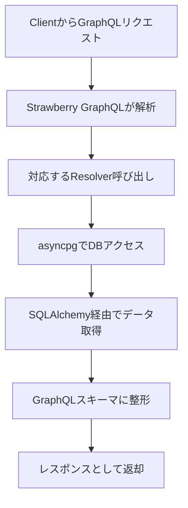

# GraphQL API プロジェクト概要

このプロジェクトは、**Python** を使用して構築された **GraphQL API** を提供するアプリケーションです。データベースには **Neon** 上に構築された **DVD Rental Sample Database** を使用しています。

---

## 🛍️ アーキテクチャ概要

### 技術スタック

* **FastAPI**：軽量・高速な Python 製 Web フレームワーク
* **Strawberry GraphQL**：型ヒントベースの GraphQL ライブラリ
* **SQLAlchemy**：ORM を用いたデータモデル管理
* **asyncpg**：PostgreSQL 用の非同期ドライバ
* **Docker / Dev Container**：開発環境のコンテナ化

---

## 🚀 実行手順（初回セットアップ）

1. **VSCode で開発コンテナーを起動**

   * 「**コンテナでフォルダーを開く**」を選択します。

2. **SQLAlchemy モデルの自動生成（初回のみ）**

   ```bash
   sqlacodegen <DATABASE_URL> --outfile app/models.py
   ```

3. **GraphQL 型とスキーマの自動生成**

   ```bash
   cd app
   ./run_generators.sh
   ```

4. **アプリケーションの起動（コンテナ内）**

   ```bash
   uvicorn app.main:app --reload
   ```

5. **GraphQL エンドポイントにアクセス**

   * [http://localhost:8000/graphql](http://localhost:8000/graphql)

---

## 📁 ディレクトリ構成

```
.
├── app/
│   ├── __init__.py                 # アプリケーションパッケージ初期化用（空ファイルまたは初期化処理）
│   ├── main.py                     # アプリケーションのエントリポイント（FastAPI設定）
│   ├── models.py                   # SQLAlchemy による DB モデル定義
│   ├── graphql_types/              # 自動生成された GraphQL 型定義
│   ├── graphql_schema.py           # GraphQL スキーマとリゾルバ定義
│   ├── generate_graphql_type.py    # GraphQL 型定義自動生成スクリプト
│   ├── generate_graphql_schema.py  # GraphQL スキーマ自動生成スクリプト
│   └── run_generators.sh           # 上記2つのスクリプトをまとめて実行
├── .devcontainer/                  # DevContainer 関連設定
│   ├── Dockerfile                  # Python + 必要パッケージのインストール
│   ├── devcontainer.json           # VSCode 向け DevContainer 設定ファイル
│   ├── docker-compose.yml          # 開発用コンテナの構成
│   ├── entrypoint.sh               # コンテナ起動時スクリプト
│   └── requirements.txt            # Python パッケージ一覧
├── .gitignore                      # Git管理から除外するファイル一覧
└── README.md                       # このプロジェクト概要
```

---

## 🔄 データフロー概要



---

## 🔧 各コンポーネントの役割

### ✅ FastAPI

* Web フレームワークとして使用。
* `main.py` でアプリケーション初期化とルーティング設定。

### ✅ Strawberry GraphQL

* GraphQL スキーマとリゾルバの定義。
* Python の型アノテーションを活用。

### ✅ SQLAlchemy

* データベース構造を Python クラスで表現。
* DB操作を ORM 経由で実行。

### ✅ asyncpg

* PostgreSQL との非同期通信を担当。
* パフォーマンスとスケーラビリティ向上。

### ✅ 自動生成スクリプト

* `generate_graphql_type.py`
  SQLAlchemy モデルから GraphQL タイプを生成。
* `generate_graphql_schema.py`
  GraphQL スキーマ（クエリ・ミューテーション定義）を生成。

---

## 🔁 model.py / graphql\_types / graphql\_schema.py の関係性

```
models.py（SQLAlchemyモデル）
      ↓
generate_graphql_type.py により
graphql_types/*.py（GraphQL型定義）を生成
      ↓
generate_graphql_schema.py により
graphql_schema.py（スキーマ + リゾルバ）を構築
```

* **models.py**
  DBテーブルをPythonクラスとして表現（SQLAlchemy）
  → GraphQL型のベースになる

* **graphql\_types/\*.py**
  GraphQLの `type`, `input`, `enum` などの定義を含む
  → 型情報の共有を目的とした自動生成ファイル

* **graphql\_schema.py**
  `Query`, `Mutation`, `Resolver` を含む実装
  → GraphQLエンドポイントのコアロジック

---

## 📄 .env 設定例

プロジェクト直下に `.env` を作成し、以下を記述します：

```env
DATABASE_URL=postgresql+asyncpg://<USER>:<PASSWORD>@<HOST>/<DBNAME>?sslmode=require
DB_USER=your_user
DB_PASSWORD=your_password
DB_NAME=your_db
DB_HOST=your_db_host
```

---

## 📂 データベース（Neon）

* Neon（PostgreSQLベースのクラウドDB）に対応。
* `.env` によってDB接続情報を管理。


